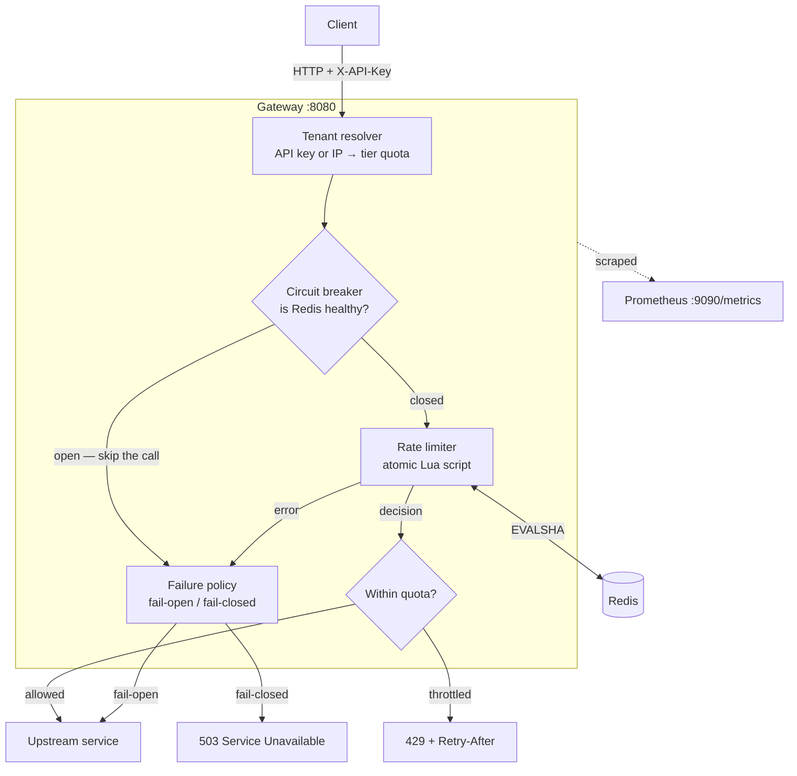
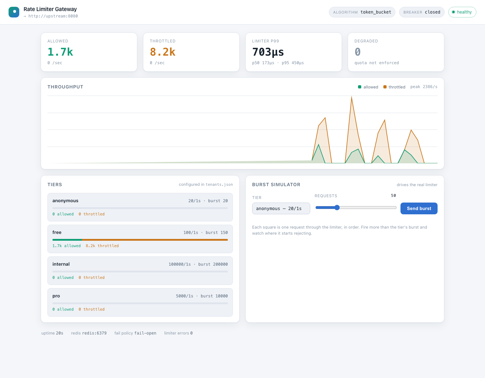

# Distributed Rate Limiter & API Gateway

[](https://github.com/Ankitnehra6/ratelimit-gateway/actions/workflows/ci.yml)
[](https://go.dev)
[](LICENSE)

A reverse proxy that enforces per-tenant request quotas across many replicas, backed by
Redis. Three rate limiting algorithms are implemented, benchmarked against each other,
and tested for the failure modes that actually break rate limiters in production.

**The problem it solves.** Rate limiting is easy on one machine and hard on ten. The
moment quota state is shared, a naive `GET`/modify/`SET` from two replicas interleaves
and both hand out the same token. And when the shared store goes down, a limiter that
was not designed for it takes the entire API down with it.

---

## Contents

- [Architecture](#architecture)
- [Quickstart](#quickstart)
- [Dashboard](#dashboard)
- [Results](#results)
- [Algorithms](#algorithms)
- [Design decisions](#design-decisions)
- [Configuration](#configuration)
- [Testing](#testing)
- [What I would do differently](#what-i-would-do-differently)

---

## Architecture



Every quota decision is one `EVALSHA` round trip. The read-modify-write happens **inside
Redis**, so replicas cannot interleave — that is the entire reason the algorithms are
written in Lua rather than Go.

---

## Quickstart

```bash
# Start the gateway, Redis, a stand-in upstream, and Prometheus
make up

# Fire enough traffic to trip the anonymous quota and show the headers
make smoke

# Load test (requires the stack to be running)
make loadtest

make down
```

| What | Where |
|---|---|
| Proxy | <http://localhost:8080> |
| **Dashboard** | **<http://localhost:9090>** |
| Metrics | <http://localhost:9090/metrics> |
| Prometheus | <http://localhost:9091> |

Ports 8080/9090 are commonly taken. If they are on your machine:

```bash
cp deploy/.env.example deploy/.env   # then edit the ports
```

Try it by hand — the anonymous tier allows 20 requests per second:

```bash
for i in $(seq 1 25); do
  curl -s -o /dev/null -w '%{http_code} ' http://localhost:8080/get
done
# 200 200 200 ... 429 429 429

curl -sD - -o /dev/null http://localhost:8080/get | grep -i ratelimit
# X-Ratelimit-Limit: 20
# X-Ratelimit-Remaining: 0
# X-Ratelimit-Reset: 1

# A pro-tier key gets 5000/s and sails through
curl -s -o /dev/null -w '%{http_code}\n' \
  -H 'X-API-Key: demo-pro-key' http://localhost:8080/get
# 200
```

---

## Dashboard

The gateway serves an operator UI on the admin port, embedded in the binary with
`go:embed` — no separate frontend build, no CDN, no runtime dependencies.



- **Live throughput** — allowed and throttled requests per second over the last minute,
  drawn from the same Prometheus counters the metrics endpoint exports.
- **Per-tier quotas** — every configured tier with its limit, burst, and traffic split,
  including tiers that have seen no traffic yet.
- **Burst simulator** — pick a tier, fire a burst, and watch the actual limiter decide.
  Each square is one request in order, green for admitted and amber for rejected, so the
  exact point where a tier's burst runs out is visible rather than described.
- **Health** — circuit breaker state, Redis reachability, and a degraded indicator that
  distinguishes "Redis is down and quota is unenforced" from "the gateway is down".

It is mounted on the admin listener, never on the proxy listener, so it is as easy to
firewall off as `/metrics` and is not reachable by API callers. The simulator drives a
dedicated `dashboard-sim:` key, so it never consumes a real tenant's quota, and it caps
the burst size — an operator tool should not become an accidental load generator.

Simulated decisions are counted under `source="simulator"` on
`gateway_rate_limit_decisions_total`, so a burst moves the chart and tier cards
immediately while production queries can still exclude operator activity:

```promql
sum by (tier) (rate(gateway_rate_limit_decisions_total{source="proxy"}[5m]))
```

The label has exactly two values, so it costs nothing in cardinality — the concern
[ADR-0004](docs/adr/0004-metrics-cardinality.md) is otherwise strict about.

---

## Results

Measured on an Apple M4 (10 cores), Redis 7 and the load generator in Docker on the same
machine. Absolute latencies include Docker Desktop's loopback overhead, so treat them as
a comparison between algorithms rather than as a datasheet for your hardware. Reproduce
with `make bench` and `make loadtest`.

### End-to-end, through the full proxy path

| Offered load | Sustained | Failures | p50 | p95 | p99 | max |
|---|---|---|---|---|---|---|
| 2,000 rps × 30s | 2,000 rps | 0 / 60,000 | 0.72 ms | 0.92 ms | **1.56 ms** | 22.4 ms |
| 8,000 rps × 20s | 8,000 rps | 0 / 160,000 | 2.11 ms | 11.6 ms | **25.9 ms** | 118 ms |

At 2,000 rps the gateway adds well under a millisecond at p99. At 8,000 rps the tail
grows sharply — but so does the load generator's, since k6, the gateway, the upstream and
Redis are all competing for the same ten cores. Finding out which of those is the real
ceiling needs a second machine, which is the honest limit of this measurement.

### Enforcement accuracy

The number that matters more than latency. A free-tier key (100/s, burst 150) was driven
at 500 rps for 10 seconds:

| Metric | Expected | Measured |
|---|---|---|
| Admitted | 150 burst + (100 × 10s) = **1,150** | **1,150** |
| Throttled | 5,001 − 1,150 = 3,851 | 3,851 |

Exact, and repeatable across runs.

### Cost per decision

`go test -bench` against a live Redis. "Concurrent" uses `RunParallel`, which is the
realistic case for a gateway.

| Algorithm | Redis ops/req | Serial | Concurrent | Allocs/op | Memory per key |
|---|---|---|---|---|---|
| Token bucket | 3 | 178 µs | **38.5 µs** | 21 | Constant (2-field hash) |
| Sliding window log | 5 | 188 µs | 38.5 µs | 24 | **Grows with request rate** |
| Fixed window | 1–2 | 179 µs | **33.7 µs** | 21 | Constant (one integer) |

The serial figures are dominated by loopback round-trip time and say more about Docker
than about the algorithms; the concurrent figures are the useful ones. Fixed window is
about 13% cheaper than the other two and materially less correct — see below.

---

## Algorithms

All three are implemented, tested, and selectable at runtime with
`GATEWAY_ALGORITHM`.

### Token bucket — the default

[`token_bucket.lua`](internal/limiter/scripts/token_bucket.lua). Tokens refill at a
steady rate up to a burst ceiling. Constant memory, allows a configurable burst, and
degrades to a smooth rate under sustained load.

Refill is computed lazily from the elapsed time on each call rather than by a background
job, so there is nothing to schedule and idle keys cost nothing. Elapsed time is clamped
at zero, so a clock that steps backwards cannot drain a bucket.

### Sliding window log

[`sliding_window.lua`](internal/limiter/scripts/sliding_window.lua). One sorted-set entry
per request, scored by arrival time. Exactly accurate with no boundary artefact at all.

The cost is memory: a tenant sending 5,000 rps against a 60-second window holds 300,000
sorted-set members. Correct, and expensive — appropriate when a quota is contractual and
being slightly wrong is worse than being slightly slow.

### Fixed window

[`fixed_window.lua`](internal/limiter/scripts/fixed_window.lua). One counter per aligned
window. Cheapest by every measure and included mainly as the baseline the others are
compared against.

Its flaw is real and the test suite asserts it rather than hiding it: a client can send
the full limit in the last millisecond of one window and the full limit again in the
first millisecond of the next, so the true worst case is **2× the configured limit**.
[`TestFixedWindowAdmitsBoundaryBurst`](internal/limiter/limiter_test.go) demonstrates
exactly that — 10 requests admitted in 2 ms against a "5 per second" limit.

---

## Design decisions

Recorded in full under [`docs/adr/`](docs/adr/). The short version:

**Lua, not client-side transactions.** `WATCH`/`MULTI` would need a retry loop and would
livelock on a hot key under contention. A Lua script is a single round trip that Redis
executes atomically. ([ADR-0001](docs/adr/0001-lua-scripts-for-atomicity.md))

**Fail open by default.** When Redis is unreachable the gateway serves traffic and sets
`X-RateLimit-Degraded: true` rather than rejecting everything. A rate limiter exists to
protect an upstream from excess load, not to become a new single point of failure — the
common outage is Redis being briefly unavailable, and turning that into a total API
outage trades a small problem for a large one. `GATEWAY_FAIL_OPEN=false` inverts this
for quotas that protect something genuinely fragile, like a metered third-party API.
([ADR-0002](docs/adr/0002-fail-open-by-default.md))

**A circuit breaker in front of Redis.** Without it, an unreachable Redis adds the full
timeout to every request the gateway serves — the limiter's own latency becomes the
outage. After five consecutive failures the breaker opens and the failure policy applies
immediately, with a single probe admitted after the cooldown to test recovery.
([ADR-0003](docs/adr/0003-circuit-breaker-around-redis.md))

**Metrics labelled by tier, never by tenant.** Tenant IDs are unbounded; an unbounded
Prometheus label eventually takes down the monitoring stack. Per-tenant detail goes to
structured logs instead. ([ADR-0004](docs/adr/0004-metrics-cardinality.md))

**`X-Forwarded-For` is not trusted by default.** Anonymous callers are limited by IP. If
the header were believed unconditionally, any caller could rotate it and mint unlimited
quota. Enable `GATEWAY_TRUST_FORWARDED_FOR=true` only behind a proxy that overwrites the
header.

---

## Configuration

All configuration is environment variables; tenants and tiers live in a JSON file.

| Variable | Default | Description |
|---|---|---|
| `GATEWAY_LISTEN_ADDR` | `:8080` | Proxy listen address |
| `GATEWAY_METRICS_ADDR` | `:9090` | Metrics listen address, deliberately separate |
| `GATEWAY_UPSTREAM_URL` | `http://localhost:8081` | Where admitted traffic goes |
| `GATEWAY_ALGORITHM` | `token_bucket` | `token_bucket`, `sliding_window`, `fixed_window` |
| `GATEWAY_TENANTS_PATH` | `tenants.json` | Tenant and tier definitions |
| `GATEWAY_FAIL_OPEN` | `true` | Serve or reject when the limiter cannot decide |
| `GATEWAY_LIMITER_TIMEOUT` | `50ms` | Cap on the Redis call |
| `GATEWAY_BREAKER_THRESHOLD` | `5` | Consecutive failures before the breaker opens |
| `GATEWAY_BREAKER_COOLDOWN` | `5s` | Wait before probing recovery |
| `GATEWAY_TRUST_FORWARDED_FOR` | `false` | Believe `X-Forwarded-For` for client IP |
| `REDIS_ADDR` | `localhost:6379` | Redis address |
| `REDIS_POOL_SIZE` | `128` | Connection pool size |

Tiers and keys ([`tenants.json`](tenants.json)):

```json
{
  "tiers": {
    "anonymous": { "limit": 20,   "window": "1s", "burst": 20 },
    "pro":       { "limit": 5000, "window": "1s", "burst": 10000 }
  },
  "keys": {
    "demo-pro-key": { "tenant_id": "demo-pro", "tier": "pro" }
  },
  "anonymous_tier": "anonymous"
}
```

Responses carry `X-RateLimit-Limit`, `X-RateLimit-Remaining` and `X-RateLimit-Reset`, and
rejections carry `Retry-After`, so a well-behaved client can pace itself instead of
discovering the limit by being rejected.

---

## Testing

```bash
make redis    # start a Redis for the integration tests
make test     # go test -race ./...
make cover
make bench
```

The limiter tests run the real Lua against a real Redis, because the Redis interaction
*is* the behaviour under test — a mocked client would only assert that the test's model
matches itself. They skip cleanly when no Redis is reachable, and CI runs them against a
service container.

Worth reading:

- **[`TestConcurrentCallsNeverOverspend`](internal/limiter/limiter_test.go)** — 500
  goroutines race on one key across all three algorithms and exactly 100 are admitted
  every time. This is the test the entire Lua design exists for.
- **[`TestFixedWindowAdmitsBoundaryBurst`](internal/limiter/limiter_test.go)** — asserts
  the boundary flaw deliberately, so the trade-off is documented in code.
- **[`TestBreakerStopsCallingAFailedLimiter`](internal/middleware/ratelimit_test.go)** —
  20 requests against a dead Redis produce exactly 3 Redis calls.
- **[`TestForwardedForIgnoredWhenUntrusted`](internal/tenant/tenant_test.go)** — a
  spoofed header cannot escape an IP quota.

Time is injected everywhere (`WithClock`), so refill, window rolls and breaker cooldowns
are tested deterministically without a single `time.Sleep`.

---

## What I would do differently

- **Measure from a second machine.** Every number above was produced with the load
  generator sharing a laptop with everything it was measuring. The 8,000 rps tail is
  probably contention, but I cannot prove that from these runs.
- **Add a local pre-check before the Redis call.** A per-replica in-memory counter could
  reject callers already far over quota without a network round trip, cutting Redis load
  on abusive traffic. It makes the limiter approximate, which is why it is not in yet.
- **Replicate quota state instead of sharing it.** A single Redis is a shared fate for
  every replica. Redis Cluster with the tenant ID as the hash key would shard cleanly,
  since every operation is already single-key.
- **Sliding window counter as a fourth algorithm.** It interpolates between two fixed
  windows: most of the log's accuracy at the counter's constant memory. It is the option
  I would actually reach for in production, and its absence here is the clearest gap.

---

## License

MIT — see [LICENSE](LICENSE).
